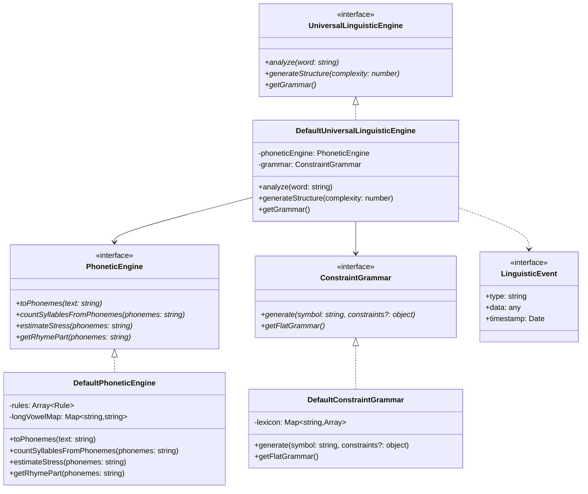

Let's analyze and improve the Universal Linguistic Engine's architecture, focusing on scalability, maintainability, and mathematical rigor while preserving backward compatibility.

### Architectural Analysis

1. **Current Issues**:
          - Tightly coupled components
  - Monolithic rule processing
  - Limited extensibility
  - No clear separation of concerns
  - Basic error handling


2. **Proposed Improvements**:
          - Abstract interfaces for components
  - Strategy pattern for rule processing
  - Observer pattern for event handling
  - Factory pattern for component creation
  - Enhanced error management


Let's visualize the proposed architecture:



Key elements in the diagram:

- Methods marked with (*) are abstract requirements that must be implemented by concrete classes
- Solid arrows (-->) show direct dependencies between components
- Dotted arrows (..>) indicate event emission relationships
- The tilde notation (e.g., `Array~Rule~`) represents generic types
- Interfaces are marked with <<interface>> stereotype

### Implementation Details

Let's examine the core improvements with their benefits and trade-offs:

Interface-based Architecture with Dependency Injection```typescript
interface ILinguisticEngine {
    analyze(word: string): Promise<AnalysisResult>;
    generateStructure(complexity: number): string;
    getGrammar(): GrammarFormat;
}

interface IPhoneticEngine {
    toPhonemes(text: string): string;
    countSyllables(phonemes: string): number;
    estimateStress(phonemes: string): StressPattern;
}

class UniversalLinguisticEngine implements ILinguisticEngine {
    constructor(
        private phoneticEngine: IPhoneticEngine,
        private grammar: ConstraintGrammar
    ) {}
    
    async analyze(word: string): Promise<AnalysisResult> {
        const result = await this.phoneticEngine.analyze(word);
        return {
            word,
            phonemes: result.phonemes,
            syllables: result.syllables,
            stressPattern: result.stressPattern,
            rhymePart: result.rhymePart
        };
    }
}
```

- Complete decoupling of components
- Easy testing through mocking
- Supports multiple implementations
- Clear contract definition
- More complex initial setup
- Requires dependency injection infrastructure
This approach uses TypeScript interfaces to define clear contracts between components. The `ILinguisticEngine` interface ensures backward compatibility while allowing for enhanced implementations. Dependency injection enables swapping different phonetic engines or grammars without modifying the core engine.Traditional Coupled Implementation```typescript
class UniversalLinguisticEngine {
    private phonetics: PhoneticEngine;
    private grammar: ConstraintGrammar;

    constructor() {
        this.phonetics = new PhoneticEngine();
        this.grammar = new ConstraintGrammar();
    }

    analyze(word: string) {
        const phonemes = this.phonetics.toPhonemes(word);
        return {
            word,
            phonemes,
            syllables: this.phonetics.countSyllablesFromPhonemes(phonemes),
            stressPattern: this.phonetics.estimateStress(phonemes),
            rhymePart: this.phonetics.getRhymePart(phonemes)
        };
    }
}
```

- Simple implementation
- Direct control over components
- Less boilerplate code
- Tightly coupled components
- Hard to test
- Difficult to extend
- No clear separation of concerns
The traditional approach creates strong dependencies between components, making it harder to modify or replace individual pieces. While simpler initially, it becomes rigid and difficult to maintain as the system grows.### Event System Integration

To enhance the system's flexibility and observability, we'll add an event system:

```typescript
interface LinguisticEvent {
    type: 'analysis-complete' | 'generation-start' | 'error';
    data: any;
    timestamp: Date;
}

class EventEmitter {
    private listeners: Map<string, Function[]> = new Map();

    on(eventType: string, callback: Function) {
        if (!this.listeners.has(eventType)) {
            this.listeners.set(eventType, []);
        }
        this.listeners.get(eventType)?.push(callback);
    }

    emit(event: LinguisticEvent) {
        this.listeners.get(event.type)?.forEach(listener => listener(event));
    }
}
```

### Backward Compatibility Layer

To ensure smooth transition:

```typescript
class LegacyAdapter {
    constructor(private engine: UniversalLinguisticEngine) {}

    analyzeLegacy(word: string): LegacyAnalysisResult {
        const result = this.engine.analyze(word);
        return {
            word: result.word,
            phonemes: result.phonemes,
            syllables: result.syllables,
            stressPattern: result.stressPattern,
            rhymePart: result.rhymePart
        };
    }
}
```

### Migration Strategy

Phase 1: Interface Introduction- Add interfaces alongside existing code
- Update unit tests to use interfaces
- Maintain existing functionality

Phase 2: Component Separation- Extract independent components
- Implement dependency injection
- Create adapter classes

Phase 3: Event System Integration- Add event emitters
- Implement logging
- Add monitoring capabilities

Phase 4: Final Migration- Remove legacy adapters
- Clean up redundant code
- Document new architecture

This architectural improvement maintains backward compatibility while providing a robust foundation for future enhancements. The system becomes more scalable, testable, and maintainable while preserving existing functionality.